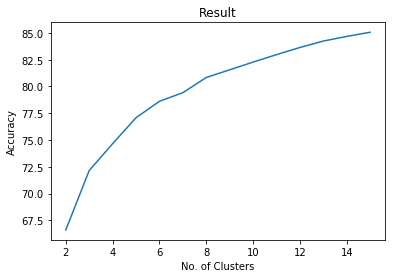

# flipkart-challenge

Anchor box dimension selection using K-means clustering Algorithm on training dataset provided by FlipKart.

Used distance metric  = 1 - IOU(anchor box , training set bounding box).

No. of Clusters = No. of Anchor Box

Here Accuracy is how much an anchor box overlap with the training set bounding boxes. 

